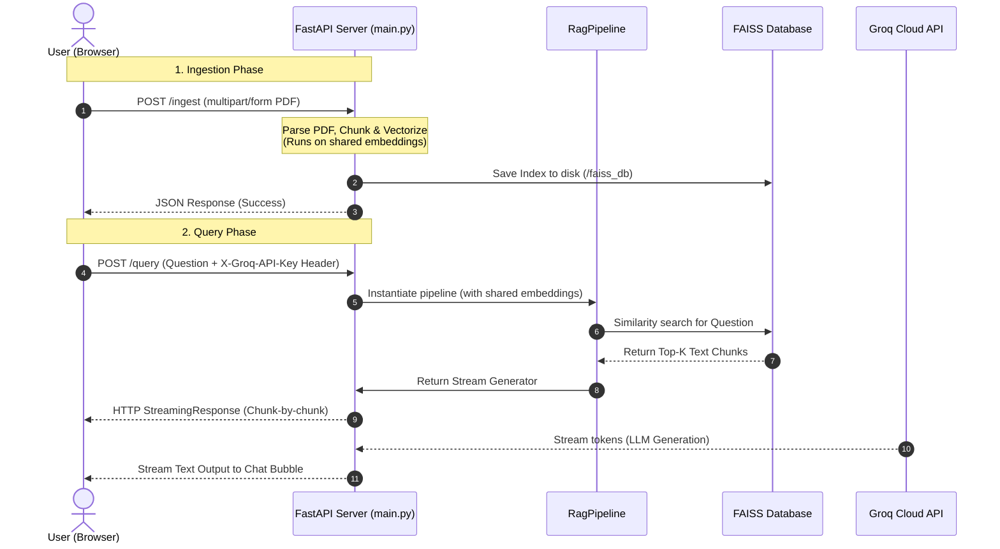

# RAG Document Q&A System

A stateless, lightweight, state-of-the-art Document Q&A system powered by **Llama 3 (via Groq)** and local **HuggingFace Embeddings (`all-MiniLM-L6-v2`)**. It features a fully self-contained, glassmorphic frontend with real-time text streaming.

---

## 🏗️ System Architecture

The project splits functionality into two isolated pipelines: **Ingestion** and **Retrieval / Inference**.

```mermaid
graph TD
    %% Ingestion Flow
    subgraph Ingestion Pipeline
        A[Upload PDF] --> B[Docling Converter]
        B -->|Convert to Markdown| C[MarkdownHeaderTextSplitter]
        C -->|Split by Headers| D[Safety RecursiveSplitter]
        D -->|Generate Semantic Chunks| E[Shared Embeddings Model]
        E -->|all-MiniLM-L6-v2| F[(FAISS Vector Store)]
    end

    %% Query Flow
    subgraph Query Pipeline
        G[User Query] --> H[Shared Embeddings Model]
        H -->|Generate Query Vector| I[FAISS Vector Store]
        I -->|Semantic Similarity Search| J[Retrieve Top K Chunks]
        J -->|Combine Chunks as Context| K[Prompt Builder]
        L[Chat History] --> K
        K -->|Inject Context & History| M[Llama 3 Model via Groq]
        M -->|Streaming Response| N[Frontend Glassmorphic UI]
    end
    
    style Ingestion fill:#1e1b4b,stroke:#4f46e5,stroke-width:2px,color:#ffffff
    style Query fill:#083344,stroke:#06b6d4,stroke-width:2px,color:#ffffff
    style F fill:#064e3b,stroke:#10b981,stroke-width:2px,color:#ffffff
    style I fill:#064e3b,stroke:#10b981,stroke-width:2px,color:#ffffff
```



---

## 📦 Project Structure & Modularity

The project is structured as a clean, modular Python package:

```text
rag-document-q&a-project/
├── __init__.py               # Package initializer exposing core engines
├── doc_processing_engine.py   # Document ingestion, splitting, and vectorizing
├── llm_engine.py             # Context retrieval and LLM reasoning chain
├── rag_pipeline.py           # Orchestrator coordinating ingestion and QA
├── main.py                   # FastAPI server exposing the endpoints
├── index.html                # Custom CSS glassmorphic streaming UI
└── README.md                 # Project guide and documentation
```

### Module Descriptions:

*   **`doc_processing_engine.py`**:
    Parses PDF files into structured layouts (headers, tables, lists) using the `Docling` library. It splits the document structurally by Markdown headers to keep contextual boundaries, runs a secondary recursive splitting for safety limits, and generates local embeddings to save in a `FAISS` database.
*   **`llm_engine.py`**:
    Handles retrieving the relevant text chunks, setting up the RAG system prompt with memory, and building the LangChain Expression Language (LCEL) chain. It contains a modular history trimmer that slices the chat history to the last 2 turns (4 messages) to avoid token bloat.
*   **`rag_pipeline.py`**:
    Acts as the orchestrator class. It coordinates the ingestion of documents and queries, forwarding them to their respective sub-engines. It also manages stateful chat history in the pipeline instance.
*   **`main.py`**:
    Exposes the stateless HTTP endpoints. It utilizes the **Singleton Pattern** to load the HuggingFace embedding model weights globally once on startup, preventing the 1-3 seconds reloading latency on queries.
*   **`index.html`**:
    A zero-framework web client that secures the user's Groq API key in local storage, handles file selection and uploading, and consumes streaming responses chunk-by-chunk using raw JS streams.

---

## 🔄 Interaction Sequence Flowchart



---

## ⚡ Key Optimizations

1.  **Shared Embeddings Singleton:**
    Loading a local PyTorch model (`all-MiniLM-L6-v2`) on every request causes massive CPU/RAM bottlenecks. `main.py` loads the model once globally and passes the reference (`shared_embeddings`) to the engines. Queries are resolved in under 100ms.
2.  **Stateless API Design:**
    The API does not store API keys or persistent user histories. The API keys are provided by the client, and chat history is sent from the frontend/caller or discarded, allowing the server to remain lightweight and scale horizontally.
3.  **Active Memory Trimmer:**
    LangChain LCEL uses a custom `trim_history` filter method. It slices message collections dynamically to keep only the last 2 turns (4 messages), ensuring the LLM is context-grounded without running out of token limits.

---

## 🚀 Getting Started

### Prerequisites

Make sure Python 3.10+ is installed. In your virtual environment, install the dependencies:

```bash
pip install fastapi uvicorn pydantic docling langchain langchain-community langchain-huggingface langchain-groq sentence-transformers python-multipart
```

### Running the Project

1.  **Start the FastAPI server:**
    Run the server from the project directory:
    ```bash
    python main.py
    ```
    The server will start on `http://localhost:8000`.

2.  **Launch the Frontend:**
    Double-click the `index.html` file to open it directly in your web browser.

3.  **Chat with your document:**
    *   Paste your Groq API Key (`gsk_...`) in the sidebar.
    *   Upload a PDF file and click **Ingest Document**.
    *   Type a question and watch the RAG pipeline stream answers in real-time.
